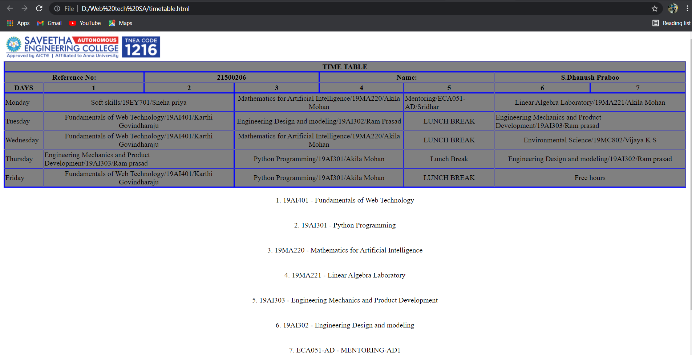

# Experiment_Time_Table

## AIM
To Write a html webpage page to display your timetable.

# ALGORITHM
### STEP 1
create a simple table using table tag
### STEP 2
Add header row using th tag
### STEP 3
Add your timetable
### STEP 4
Execute the program

# CODE
~~~
<!DOCTYPE html>
<html>

   <head>
      <title>TIME TABLE</title>
   </head>

   <body>
	</img>
      <table border = "1" cellspacing="1" bordercolor="blue" bgcolor="grey">
         <tr>
	     	
            <th colspan="8">TIME TABLE</th>

         </tr>
	<tr>
		<th colspan="2">Reference No:</th>
        	<th colspan="2">21500206</th>
		<th colspan="2">Name:</th>
		<th colspan="2">S.Dhanush Praboo</th>
	</tr>
         <tr>
            <th>DAYS</th>
            <th>1</th>
            <th>2</th>
            <th>3</th>
            <th>4</th>
            <th>5</th>
            <th>6</th>
            <th>7</th>
           
         </tr>
       
 
  <tr>
             <td>Monday</td>
             <td colspan="2">
Soft skills/19EY701/Sneha priya
</td>
             <td colspan="2">
Mathematics for Artificial Intelligence/19MA220/Akila Mohan
</td>
             <td><centre>Mentoring/ECA051-AD/Sridhar</centre></td>
             <td colspan="2">
Linear Algebra Laboratory/19MA221/Akila Mohan
</td>
</tr>
<tr>
             <td>Tuesday</td>
             <td colspan="2">
Fundamentals of Web Technology/19AI401/Karthi Govindharaju
</td>
             <td colspan="2">
Engineering Design and modeling/19AI302/Ram Prasad
</td>

             <td>
LUNCH BREAK
</td>
             <td colspan="2"
Engineering Mechanics and Product Development/19AI303/Ram prasad
</td>
</tr>
<tr>
             <td>Wednesday</td>
             <td colspan="2">
Fundamentals of Web Technology/19AI401/Karthi Govindharaju
</td>
             <td colspan="2">
Mathematics for Artificial Intelligence/19MA220/Akila Mohan
</td>
             <td>
LUNCH BREAK
</td>
             <td colspan="2">
Environmental Science/19MC802/Vijaya K S
</td>
</tr>
  <tr>
             <td>Thursday</td>
             <td colspan="2"
Engineering Mechanics and Product Development/19AI303/Ram prasad
</td>
             <td colspan="2">
Python Programming/19AI301/Akila Mohan
</td>
             <td>
Lunch Break
</td>
             <td colspan="2">
Engineering Design and modeling/19AI302/Ram prasad
</td>

</tr>
<tr>
             <td>Friday</td>
             <td colspan="2">
Fundamentals of Web Technology/19AI401/Karthi Govindharaju
</td>
             <td colspan="2">
Python Programming/19AI301/Akila Mohan
</td>
             <td>
LUNCH BREAK
</td>
             <td colspan="2">
Free hours
</td>
</tr>

 
        
      </table>
     
1. 19AI401 - Fundamentals of Web Technology
 
     
2. 19AI301 - Python Programming
 
     
3. 19MA220 - Mathematics for Artificial Intelligence
 
     
4. 19MA221 - Linear Algebra Laboratory
 
     
5. 19AI303 - Engineering Mechanics and Product Development
 
     
6. 19AI302 - Engineering Design and modeling
 
     
7. ECA051-AD - MENTORING-AD1
 
     
8. 19MC802-Environmental Science
 
 <centre>9. 19EY701-Soft Skills</centre> 
      
     
   </body>
</html

~~~
# OUPUT

